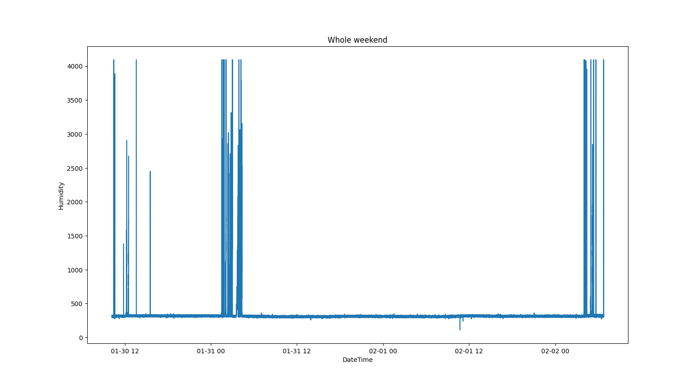
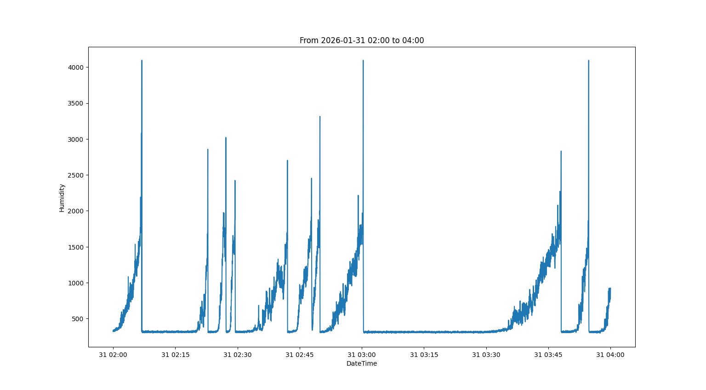
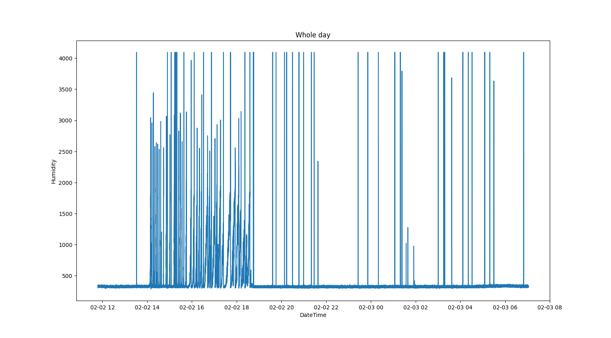
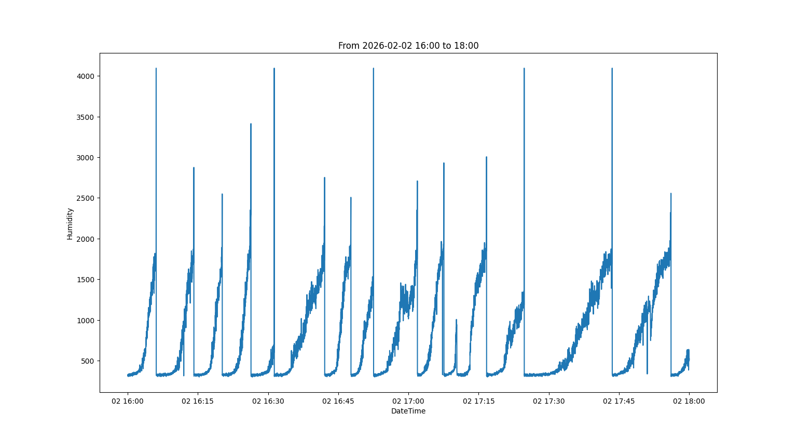
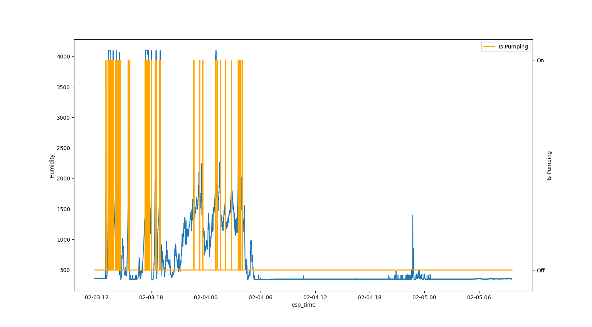
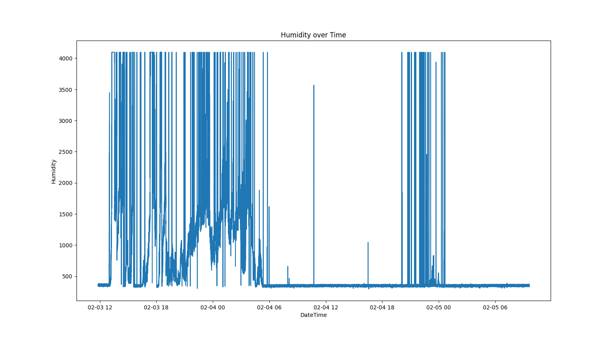
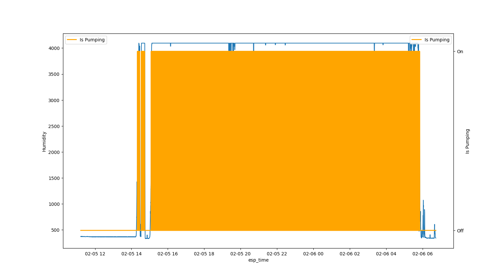

# Data Report

## 1. Data Log: 2026-02-02

#### Theory:

    None yet!

#### Parameters:

        - Pump delay: 200 ms
        - Humidity level for pumping: 2200
        - Watering when humidity is measured
        - Min pause between watering: none
        - Sensor far away from watering

#### Results:

    It partly behaves like we expect:

    If zoom in on 2 hours it behave like we expect (but only those 2 hours):

#### Conclusion:

    The cotton wool is soaking wet, so something is wrong. We can see the sensor is oxidating. Therefore we suspect the sensor is broken.

## 2. Data Log: 2026-02-03

#### Theory:

    There is something wrong with the sensor and it is getting worse because it is oxidating. Because there is too much water, we are moving the sensor close to the watering to detect the humidity sooner and we are heighten the humidity level for pumping.

#### Parameters:

        - Pump delay: 200 ms
        - Humidity level for pumping: 2400
        - Watering when humidity is measured
        - Min pause between watering: none
        - Sensor close watering

#### Results:

    It again partly behaves like we expect:

    If zoom in on 2 hours in the start it again behave like we expect:

    If zoom in on 2 hours in the later part it is missing the build up for high points:

#### Conclusion:

    The cotton wool is soaking wet, so something is still wrong. It looks like the sensor is sometimes measuring high dryness, when it should not.

## 3. Data Log: 2026-02-05

#### Theory:

    The sensor is sometimes measuring high dryness which looks wrong and that causes the cotton wool to be watered too much and over time be too wet.

#### Parameters:

        - Pump delay: 200 ms
        - Humidity level for pumping: 2400
        - Watering when humidity is measured as an average over the last 60 sec
        - Min pause between watering: 60
        - Sensor far away from watering

#### Results:

    We again see the same pattern that it is getting too wet after a while (average humidity on y-axis):

    We have fixed a problem it would have been watering even more if it was not for the new code. This is with the actual humidity on the y-axis:

#### Conclusion:

    The cotton wool is still soaking wet, so something is still something wrong. We still see that periodic the sensor is measuring too high values, but we have corrected it with the new code. Now it makes sense to look at the pump, because it seems like the sensor partly working.

## 4. Data Log: 2026-02-06

#### Theory:

    The pump is sometimes pumping too much water. Therefore we are setting down the pump delay to try to correct it. We are also experimenting by moving the sesor closer to the watering.

#### Parameters:

        - Pump delay: 100 ms
        - Humidity level for pumping: 2400
        - Watering when humidity is measured as an average over the last 60 sec
        - Min pause between watering: 60
        - Sensor close watering

#### Results:

    We got no results. The pump stopped functioning:

#### Conclusion:

    By testing the pump I observed that sometimes the pump is pumping more than 1 dl - sometimes not so much. The new theory is that the pump is pumping very inconsistent and sometimes a lot of water.
    Next step would be testing the pump outside the watering enviroment and see if this is true and if there is a way to correct it.
